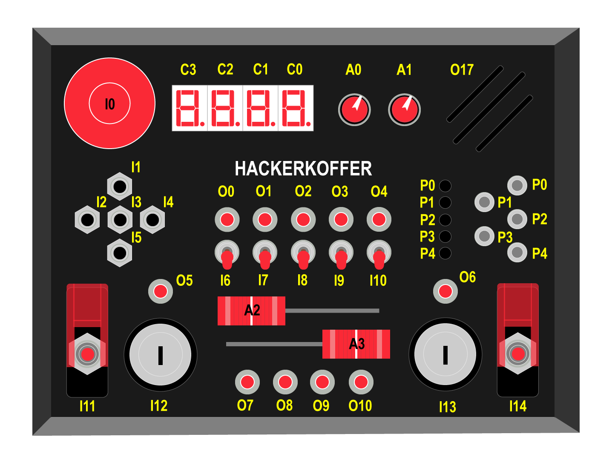

Hinweis: `D = I`

## Datenformat (senden und empfangen)
```t ID data;```

t: Typ {A, I, O, P, C, D} analog, input, output, patch, character, display

ID: Integer, der das Modul angibt

data: Wert

# Module
## Input
Eingaben am Koffer.

### Potis
Signal kommt bei Veränderung um mindestens 10.

Typ: `A`

ID:
* 0-1 Drehpotis
* 2-3 Slider

Wert: 0-4096

### Patchpanel
Signal kommt, wenn ein Kabel aus- oder eingesteckt wird und zeigt die Verbindung (ID zu Wert).

Typ: `P`

ID: 0-4 (linke Seite, von oben nach unten)

Wert: 0-4 oder 255 (rechte Seite von oben nach unten oder nicht eingesteckt)

### Knöpfe
Typ: `I`

ID: 
* 0 Notaus
* 1-5 Tastenkreuz
* 6-10 Kippschalter
* 11 Kippschalter des Todes (links)
* 12 Schlüsselschalter (links)
* 13 Schlüsselschalter (rechts)
* 14 Kippschalter des Todes (rechts)


## Output
Output sind Dinge, die Informationen auf dem Board ausgeben

### LEDs
Typ: `O`

ID:
* 0-4 Reihe mitte
* 5 Schlüsselschalter-Indikator (links)
* 6 Schlüsselschalter-Indikator (rechts)
* 7-10 Reihe unten

Wert: 0,1

### Piepser
Typ: `O`

ID:
* 15 Hoch
* 16 Tief

Wert: 0,1

### Lüfter
Typ: `O`

ID: 17

Wert: 0,1

### 7-Segment-Display
Bitmaske (Dezimal) senden, um Zahl zu setzen.

Typ: `C`

ID: 0-3 (rechts nach links)

Wert: 
* Top Left 2
* Top 4
* Top Right 8
* Middle 1
* Bottom Left 16
* Bottom 32
* Bottom Right 64
* Dot 128
* Blank 0

## DISPLAY
OLED-Display, wird mit x,y Koordinate angesteuert.

Typ: `D`

ID: 0

Wert:  `x y z`
* x 0-127
* y 0-63
* z (0,1) off/on
